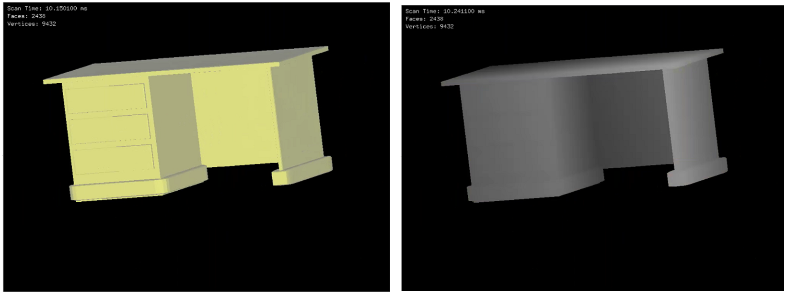

# CG_Modeling_RenderingSystem

## Description
A simple modeling and rendering system, realized a soft rasterizer by zbuffer ScanLine &amp; interval ScanLine algorithm, supports model editing and design.

## Requirements
- Environment: Windows 10
- Qt5 (for GUI)
- OpenGL (for displaying the rendered image, can replace with OpenCV or other libraries that can display the image)
- glm (for matrix calculation)
- Language: C++

## Usage
- Run `release/CG_Scanline.exe` directly
- GUI:
  
- Operation:
  - **Model operation**: mouse click and drag to move/scale/zoom the model
  - **Model edit**: drag the anchor points to deform the model
  - **Model design**: drag the control points to design your model based on the basis model
  
## Project structure
- `models`: store some provided models
  - `models/design`: store some designed models using the `Design model` function of the system
- `imgs`: some results about performance of ScanLine methods and system functions
- `src`: the source code
- `release`: the exe file and dll

## Demo
1. Rendered result using two ScanLine method (**left**: zbuffer ScanLine; **right**: interval ScanLine)

2. Two display mode (color and depth)

3. Model edit

4. Model design

